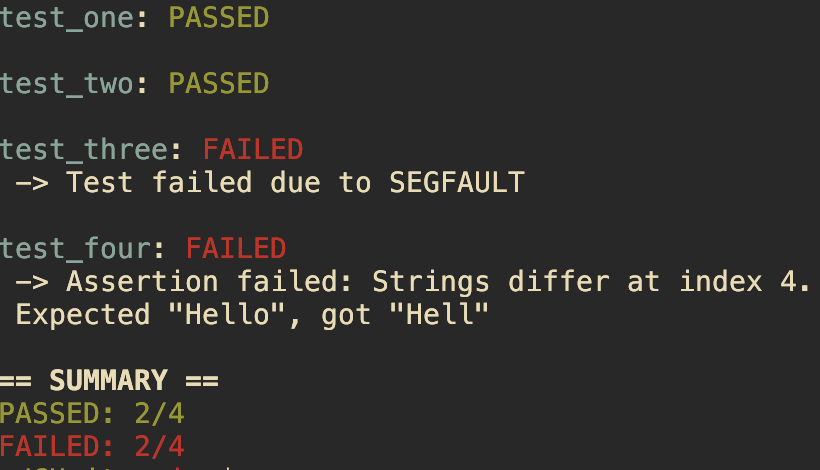

# CUnit

Simple and automatic single header C unit testing tool.

### Syntax:
```c
#include "cunit.h" 

TEST(test_one) {
	ASSERT_EQ_STR("bello", "bello");
}

TEST(test_two) {
	ASSERT_EQ_INT(10, 10);
}

//SEG FAULT
TEST(test_three) {
	int *p = NULL;
	*p = 42;
	ASSERT_EQ_INT(42, *p);
}

//THIS TEST WILL FAIL
TEST(test_four) {
	ASSERT_EQ_STR("Hello", "Hell");
}

int main() {
	run_tests();
	return 0;
}
```

### Basic Usage:


### Compatibility
This tool uses the \_\_attribute\_\_((constructor)) extension, so make sure that your compiler supports it.
